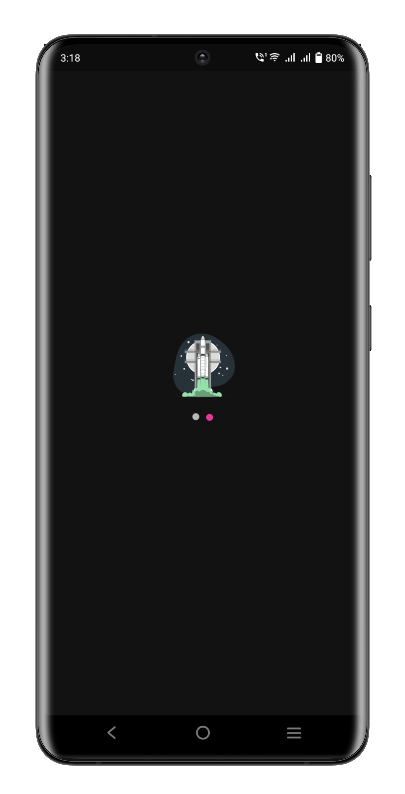
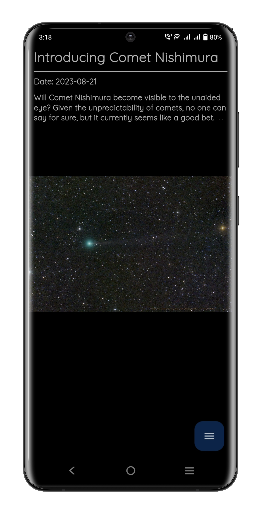
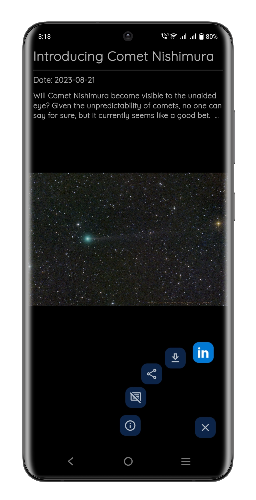
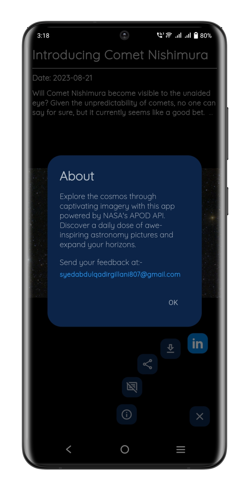
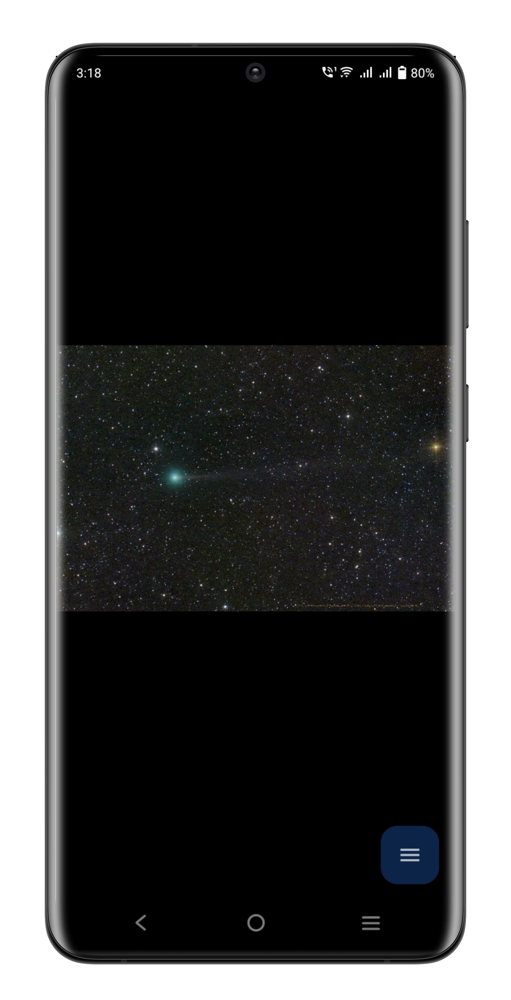
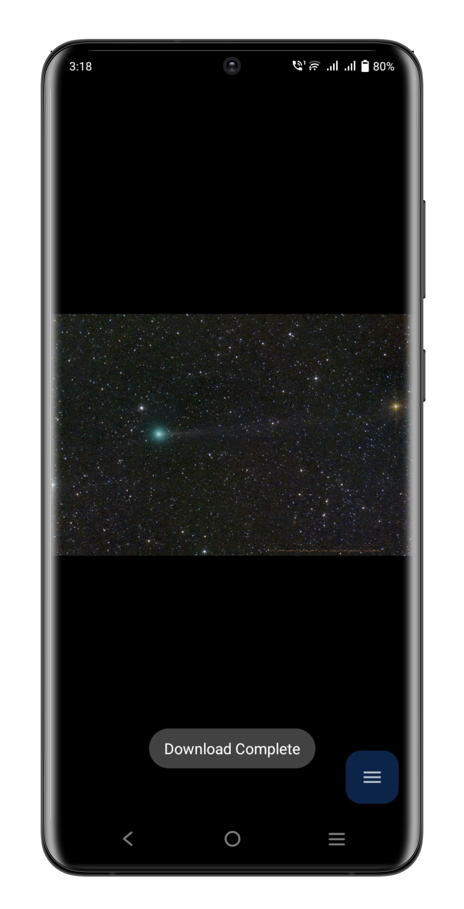
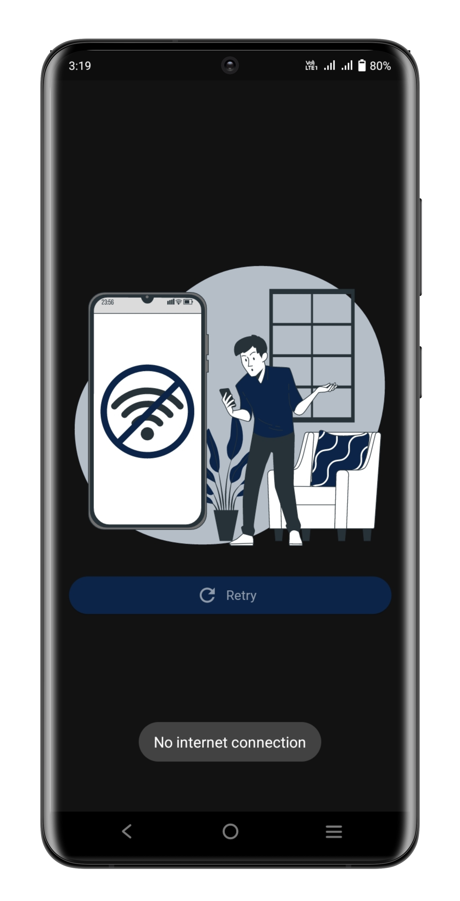

# Stellar Snapshots

A flutter application that is powered by Nasa's APOD (Astronomy Picture of the Day) API.

## Key Features
- Image zoom and interactivity
- Image Caching
- Detail Sharing
- Image Downloading
- Image Details
- Feedback functionality using default mail-box
- Get a daily dose of awe-inspiring astronomy pictures.

## Screenshots

## Getting Started
1. Clone this repository.
2. Make sure you have Flutter installed on your machine.
3. Navigate to the project directory and run `flutter pub get` to install dependencies.
4. Run the app using `flutter run`.

    ### OR

    To try out the app, you can download and install the APK file from the following link:
    [Download APK](https://drive.google.com/file/d/1QDU5X4tdmHP475_FLN8gy9gwVhUlHOU1/view?usp=sharing)
    
    Make sure to enable installation from unknown sources on your device before installing the APK.
    
    Once the APK is installed, you can open the app and start exploring.

## Resources

- [NASA APOD API](https://api.nasa.gov/)
